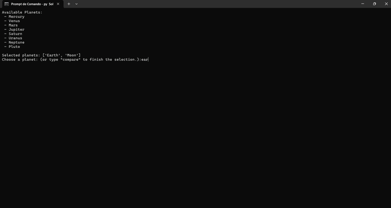

#  Solar System Kinematics Simulator

A basic, interactive Python simulator designed to evaluate, compare, and visualize vertical launch equations (classical kinematics) across multiple celestial bodies simultaneously.

##  About the Author
I am a 15-year-old Brazilian high school student passionate about physics. At the time of developing this project, I have been studying physics independently for just one month. My ultimate dream is to study at **MIT**, and this computational simulator represents a major milestone in my journey to build solid foundations in science, technology, and classical mechanics.

---

##  The Physics Engine & Computational Logic

The simulator models physics by assuming a frictionless environment (vacuum) and the strict application of **Classical Mechanics (MUV)** combined with the **Conservation of Mechanical Energy**.

**Surface gravity values for all celestial bodies were obtained from official NASA planetary reference data.**

### 1. Universal Takeoff Velocity ($v_0$) Calculation
The system benchmarks the user's leg power based on their real-world performance on Earth. By equating Kinetic Energy ($E_c$) and Gravitational Potential Energy ($E_p$), we isolate the initial velocity required to achieve the input height ($h_{earth}$):

$$E_c = E_p$$
$$\frac{m \cdot v_0^2}{2} = m \cdot g_{earth} \cdot h_{earth}$$

We cancel out the mass ($m$) and isolate $v_0$:
$$v_0 = \sqrt{2 \cdot g_{earth} \cdot h_{earth}}$$

### 2. Multi-Body Array Generation (Numerical Calculation)
Instead of hardcoding a single environment, the simulator utilizes an associative array (Python dictionary) storing official NASA surface gravity data ($m/s^2$). For every target injected into the selection list, the engine computes:

* **Maximum Height ($h_{max}$):** Derived from Torricelli's Equation ($v^2 = v_0^2 + 2ad$), assuming $v=0$ at the peak:
$$h_{max} = \frac{v_0^2}{2 \cdot g_{current}}$$

* **Total Air Time ($t_{total}$):** Accounting for both the ascending and descending phases:
$$t_{total} = \left(\frac{v_0}{g_{current}}\right) \cdot 2$$

The continuous parabolic trajectory is generated by a localized discrete evaluation loop running at a resolution step of $\Delta t = 0.01$ seconds:
$$S(t) = v_0 \cdot t - \frac{g_{current} \cdot t^2}{2}$$

---
## Future Scope & System Limits

### 3. Future Work
- Air resistance integration
- Escape velocity thresholds
- Orbital mechanics simulation
- 3D visual render

### 4. Limitations 
- Absence of air resistance (vacuum-only model)
- Vertical launch constraints (1D physics)
- Constant gravitational acceleration (ignores altitude decay)
- Planet treated strictly as an inertial frame

---

##  Software Architecture
* **Dynamic Legend Positioning:** Engineered a custom layout structure using `bbox_to_anchor` and `tight_layout` to prevent dataset occlusion when graphing up to 10 celestial bodies at once.*
---

## References

- NASA – Planetary Fact Sheet  
  https://nssdc.gsfc.nasa.gov/planetary/factsheet/

- NASA – Solar System Exploration  
  https://science.nasa.gov/solar-system/
